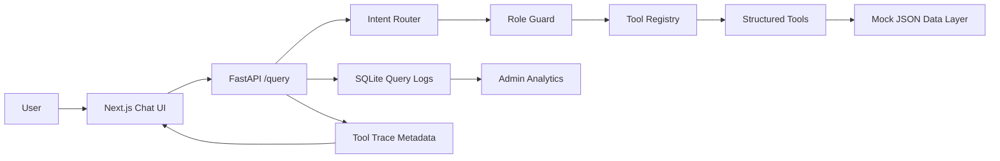

# UniAssist AI

UniAssist AI is a production-style, agentic university information assistant.
Instead of answering from model memory, it routes each user query to a structured
tool, executes that tool against trusted university data, and returns an
auditable response with trace metadata.

The project demonstrates backend AI system design, tool routing, role-based
access control, observability, and a polished full-stack user experience.

## Why This Exists

University information is scattered across calendars, directories, registration
pages, event feeds, and policy documents. A naive chatbot can hallucinate those
details. UniAssist uses an LLM-style router pattern and structured tools so the
system only answers from known data sources.



## Features

- Agentic router selects one of five structured tools
- Tools for contacts, calendar dates, events, deadlines, and registration FAQs
- No direct model-memory answers
- Consistent JSON response format
- Transparent tool trace with confidence, params, source, latency, role, and request ID
- Role-based access control for student, faculty, and admin flows
- Graceful fallback and access-denied states
- SQLite query analytics with admin-only endpoints
- Admin analytics page with usage, latency, fallback rate, and recent query logs
- Data freshness indicators in assistant responses
- Mock API mode for frontend demos when the backend is unavailable

## Forms Workflow

UniAssist now includes a governed Forms workflow for admin-managed PDF forms:

- Admins can upload PDF forms for ingestion.
- Uploaded forms enter a human review queue before student discovery.
- Admin reviewers can approve or reject pending forms.
- Students can search approved, verified forms.
- Verified PDFs open through a secure `Open Form PDF` path, so students do not need raw storage paths.
- Rejected, archived, and deprecated forms stay hidden from search and blocked from PDF access.

## Tech Stack

- Frontend: Next.js, React, Tailwind CSS
- Backend: FastAPI, Pydantic
- Persistence: SQLite
- Testing: Python `unittest`, FastAPI `TestClient`, ESLint, Next.js build checks
- Future model integration: OpenAI-compatible router and response synthesis layer

## Project Structure

```text
backend/
  app/
    api/                 # FastAPI application assembly and HTTP endpoints
    core/                # settings, constants, logging setup
    data/                # temporary mock structured datasets
    domains/
      retrieval/         # current router, tools, schemas, response formatting
      auth/              # roles and tool authorization guard
      analytics/         # analytics aggregation service
      forms/             # governed institutional forms, search, and PDF access
      documents/         # placeholder future domain
      relationships/     # placeholder future domain
      ingestion/         # ingestion routes, including PDF form upload
      orchestration/     # placeholder future domain
      governance/        # human review queue and approval decisions
    shared/
      observability/     # SQLite query logging infrastructure
      database/          # placeholder shared DB infrastructure
      events/            # placeholder event bus infrastructure
      ai/                # placeholder AI provider abstractions
      storage/           # placeholder storage abstractions
    workers/             # placeholder background workers
    scripts/             # placeholder maintenance scripts
    tests/               # backend tests
    main.py              # compatibility entrypoint for uvicorn

frontend/
  src/
    app/           # Next.js app routes
    components/    # chat, trace, role, analytics UI
    lib/           # API clients and mock API
```

## Local Setup

### Backend

```bash
cd backend
python3 -m venv venv
source venv/bin/activate
pip install -r requirements.txt
uvicorn app.main:app --reload
```

The backend runs at:

```text
http://127.0.0.1:8000
```

Health check:

```bash
curl http://127.0.0.1:8000/health
```

### Frontend

```bash
cd frontend
npm install
npm run dev
```

Open:

```text
http://localhost:3000
```

Admin analytics page:

```text
http://localhost:3000/admin/analytics
```

Admin Forms page:

```text
http://localhost:3000/admin/forms
```

## Environment Variables

Frontend:

```bash
NEXT_PUBLIC_API_BASE_URL=http://localhost:8000
NEXT_PUBLIC_USE_MOCK_API=false
```

Use mock mode when the backend is unavailable:

```bash
NEXT_PUBLIC_USE_MOCK_API=true npm run dev
```

Backend settings use the `UNIASSIST_` prefix. Example:

```bash
UNIASSIST_LOG_DB_PATH=/path/to/query_logs.sqlite3
```

## API Overview

Run a natural language query:

```bash
curl -X POST http://127.0.0.1:8000/query \
  -H "Content-Type: application/json" \
  -d '{"message":"When is add/drop deadline?","role":"student"}'
```

Admin analytics:

```text
GET /analytics/summary?role=admin
GET /analytics/tools?role=admin
GET /analytics/roles?role=admin
GET /analytics/recent?role=admin
```

Completed Forms workflow:

```text
POST /ingestion/forms/pdf
GET /governance/reviews/pending
POST /governance/reviews/decision
GET /forms/search?q=
GET /forms/{form_id}/file
```

Non-admin analytics requests return:

```json
{"error":"Access denied"}
```

## Forms Security Notes

- PDF upload and review actions are RBAC-protected for governance admin roles.
- Form search, review, and file access are tenant-aware through university scoping.
- Student-facing PDF access uses `GET /forms/{form_id}/file`; students do not receive or need raw `storage_path` values.
- PDF uploads validate content type, `.pdf` extension, file size, and PDF magic bytes before ingestion.
- Rejected, archived, and deprecated forms are excluded from retrieval and blocked from PDF file access.

## Demo Flow

1. Ask as `student`: `When is add/drop deadline?`
2. Inspect the tool trace for selected tool, confidence, params, source, freshness, and request ID.
3. Switch to `faculty` and ask: `How do I resolve registration holds?`
4. Confirm access is denied and trace explains authorization.
5. Visit `/admin/analytics` as `admin` and inspect query volume, latency, fallback rate, and recent logs.
6. Visit `/admin/forms` as an admin and upload a PDF form.
7. Confirm the uploaded form appears in the human review queue.
8. Open the pending PDF from the review queue.
9. Approve the form.
10. Search for the form as a student and open the verified PDF through `Open Form PDF`.
11. Reject another pending form and confirm it remains hidden from student search and blocked from PDF access.

## Data Freshness

Tool responses include `last_updated` metadata from the structured datasets.
The frontend displays freshness messaging and warns when data is older than 7
days. This makes it clear that answers come from structured university data, not
from model memory.

## Query Logging

Every `/query` request is persisted to:

```text
backend/app/data/query_logs.sqlite3
```

The database is generated at runtime and ignored by Git. Logged fields include:

- request ID
- query text
- selected tool
- role
- confidence
- latency
- fallback flag
- status
- timestamp

## Validation

Backend:

```bash
python3 -m compileall backend/app
python3 -m pytest backend/app/tests
```

Frontend:

```bash
npm --prefix frontend run lint
npm --prefix frontend run build
```

## Migration Notes

The backend is organized as a modular monolith. Existing Phase 1 retrieval and
tool-routing logic temporarily lives under `app/domains/retrieval` until the
future orchestration and ingestion domains are implemented. Query logging moved
to `app/shared/observability`, while analytics aggregation lives in
`app/domains/analytics`.

The compatibility entrypoint remains `uvicorn app.main:app`.

## Future Improvements

- Real university API/database integrations
- Auth provider integration with Clerk, Auth0, or NextAuth
- OpenAI-powered router with strict JSON schema outputs
- Vector search for policy documents
- Audit-log export
- Predictive analytics on common student intents
- Multi-agent workflows for complex advising tasks
